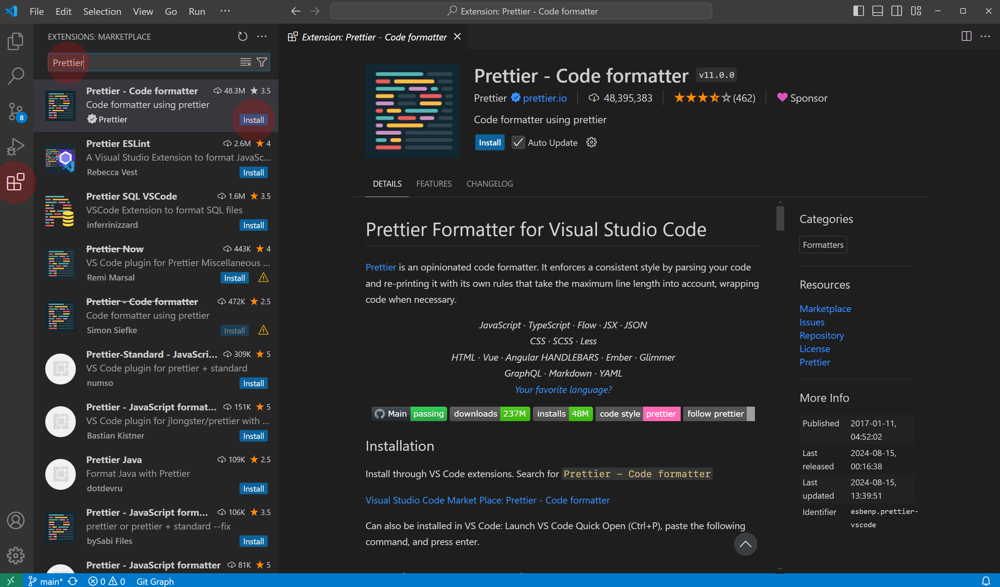
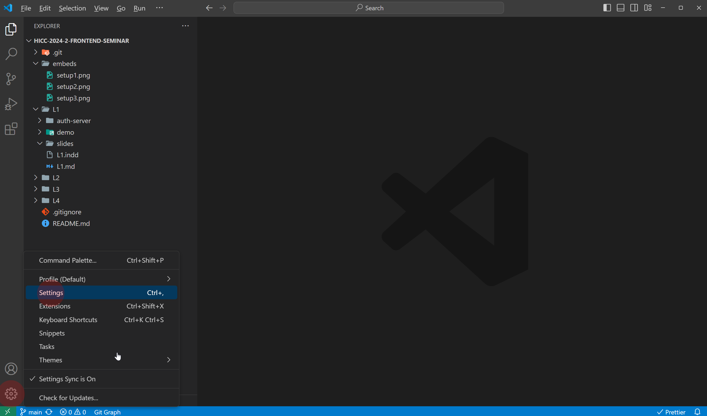
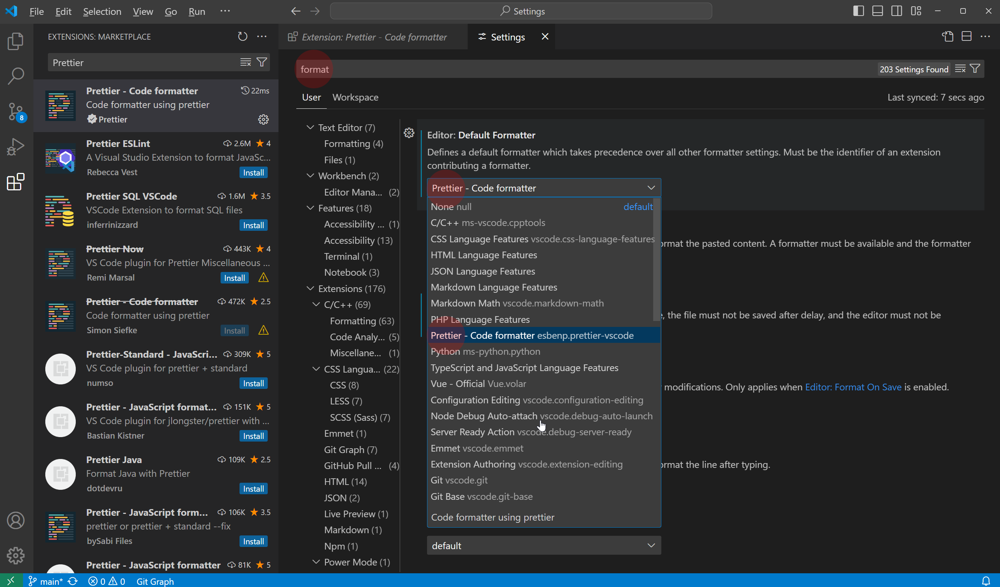
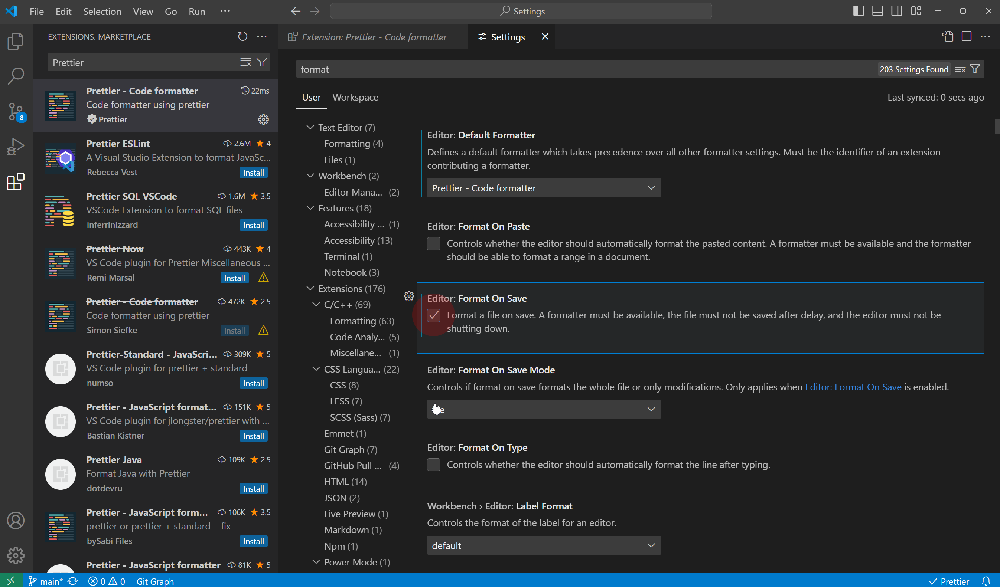

# 2024-2 HICC 프론트엔드 세미나

2024년도 2학기 HICC 프론트엔드 세미나 자료입니다. 4주차에 걸쳐 다음의 세미나를 진행합니다.

이번 프론트엔드 세미나는 기초적인 HTML, CSS, JS 의 문법을 알고 있는 사람을 대상으로 하는 세미나입니다. 학기 말의 프로젝트 발표대회를 위해 프로젝트를 만들 때 필요한 내용들을 실습 위주로 빠르게 진행합니다.

## 일정

| 주차  | 일시                   | 장소 | 세미나 자료                                                        |
| ----- | ---------------------- | ---- | ------------------------------------------------------------------ |
| 1주차 | 9월 10일 (화) 오후 6시 | C710 | 프론트엔드 기초 [`슬라이드📄`](L1/L1.pdf) [`참고자료📄`](L1/L1.md) |
| 2주차 | 9월 24일 (화) 오후 6시 | C710 | CSS로 레이아웃 구성하기 [`슬라이드📄`](L2/L2.pdf)                  |
| 3주차 | 10월 2일 (수) 오후 6시 | C710 | 외부 API와 통신하기 [`슬라이드📄`](L3/L3.pdf)                      |
| 4주차 | 10월 8일 (화) 오후 6시 | C710 | 외부 라이브러리 사용하기                                           |

## 준비 사항 (선택 사항)

이번 세미나에서는 다양한 내용을 다루어 보기 위해 주차마다 다른 내용을 진행하며, 실습 위주로 빠르게 진행합니다. 빠른 진행을 위해 아래의 준비 사항을 참조하여 준비 해 주시기 바랍니다. 기존에 사용하던 에디터나 세팅이 있는 경우 무시하셔도 됩니다.

준비 사항

### 1. VS Code 설치

이번 프론트엔드 세미나에서는 VS Code를 사용합니다. 사용할 컴퓨터에 VS Code가 설치되어 있지 않은 경우, [VS Code 공식 홈페이지](https://code.visualstudio.com/)에서 다운로드 후 설치합니다.

### 2. Prettier 설치

VS Code에는 텍스트 에티터에 여러 가지 기능을 추가할 수 있는 확장 프로그램이 있습니다. 이번 세미나에서는 Prettier 라는 코드 정렬 확장 프로그램을 사용하여 누구나 같은 코드 스타일로 코드가 작성될 수 있도록 하여, 탭이나 정렬 스타일로 인해 실습 시 코드를 잘 읽지 못하게 되는 것을 방지하고자 합니다.

- 2.1. Prettier 설치하기
  
  VS Code 좌측의 확장 프로그램 탭을 눌러 들어갑니다. Prettier를 검색한 후 `설치` 버튼을 눌러 설치합니다.

- 2.2. 설정 열기
  
  VS Code 좌측 아래의 설정 탭을 누른 후 설정에 들어갑니다.

- 2.3. 기본 코드 정렬 설정하기
  
  설정 탭의 상단 검색창에 `format` 을 검색한 후 `Editor: Default Formatter` 설정을 Prettier 확장 프로그램으로 선택 해 줍니다.

  
  다음 `Editor: Format on Save` 를 체크하여 파일을 저장할 때마다 자동으로 코드 정렬이 이루어지도록 합니다.

## 세미나 자료

## 참고 자료

- ### [_MDN Web Docs_](https://developer.mozilla.org/ko/)

  파이어폭스를 만든 모질라 재단에서 운영하는 웹 기술 문서 모음집입니다. 간단한 것부터 최근에 나온 실험적인 내용까지 간단한 예시와 함께 설명되어 있습니다. Web API 페이지에서는 브라우저에서 바로 사용할 수 있는 다양한 기능들을 확인해 볼 수 있습니다.

  - [MDN Web Docs / HTML](https://developer.mozilla.org/ko/docs/Web/HTML)
  - [MDN Web Docs / CSS](https://developer.mozilla.org/ko/docs/Web/CSS)
  - [MDN Web Docs / JS](https://developer.mozilla.org/ko/docs/Web/JavaScript)
  - [MDN Web Docs / Web API](https://developer.mozilla.org/ko/docs/Web/API)

- ### [_W3Schools_](https://www.w3schools.com/)

  간단한 튜토리얼과 함께 기본적인 웹 / 프로그래밍 관련 정보를 알려주는 사이트입니다.

- ### [_CSS-Tricks_](https://css-tricks.com/)

  웹사이트를 만들며 사용할 수 있는 방법, 조금 이상하지만 작동하는 트릭 등을 모아둔 사이트입니다. 하나의 속성이 아닌 특정 형태를 구성하기 위한 여러 가지 방법을 소개해 줍니다.

- ### [_CanIUse_](https://caniuse.com/)

  프론트엔드는 기본적으로 웹 브라우저에서 로딩되고, 실행되고, 보여집니다. 그렇기 때문에 페이지를 보는 사용 환경, OS, 브라우저 종류에 따라 지원하는 기술이나 표현 방식이 다릅니다. CanIUse 는 내가 사용하려는 기술이나 속성이 브라우저별로 얼마나, 어떻게 지원되는지 바로 확인할 수 있는 사이트입니다.

- ### [_Awwwards_](https://www.awwwards.com/)

  웹 프론트엔드 디자인 / 기술 레퍼런스를 모아 볼 수 있는 사이트입니다. 최신 웹 기술을 활용한 사아트들이 많은 편입니다.

- ### [_RegExr_](https://regexr.com/)

  웹에서 빠르게 정규 표현식을 구성하고, 테스트할 수 있는 사이트입니다.
